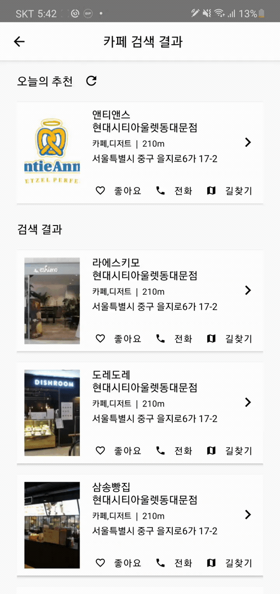

# BapSearching

> 내 주변에 있는 맛집을 검색, 필터링 하는 어플입니다. 기존에 있는 먹뱅크 프로젝트의 기능과 UI를 개선하기 위해 프로젝트를 진행하였습니다. (리뉴얼 전 링크 [github](https://github.com/ollabu3/MukBank-client) , [notion](https://www.notion.so/3-ToNaEat-MukBank-a87f0fa125d14655b4040433da09da56))
>    > [플레이스토어](https://play.google.com/store/apps/details?id=com.bapsearching)

## 주요기능

- 회원가입, 회원정보, 로그인, 로그아웃
- 내가 원하는 가게(음식점 및 카페)을 검색, 필터링
- 좋아하는 가게를 표시, 길찾기 기능
- 좋아요한 가게 리스트
    

### 회원가입, 로그인

유저가 작성한 아이디, 비밀번호, 닉네임을 밥서칭 회원가입 조건에 맞춘 후 회원가입 버튼을 누르면 회원가입이 완료됩니다.
회원가입 후 로그인을 하면 서버에서 정보를 확인한 후 토큰을 보내고 클라이언트에서 asyncStorage에 토큰을 저장함니다.

### 회원정보 및 로그아웃

로그인 후 사이드비에서 회원정보를 확인 할 수 있습니다. 로그아웃 버튼을 누르면 asyncStorage에 있는 토큰을 제거합니다.

### 검색, 필터기능

내가 원하는 가게(음식점 및 카페) 텍스트로 검색(이름)하거나 필터링(카테고리)하여 결과물(리스트)을 볼 수 있습니다. 페이징은 한페이지당 20개로 제한했으며, 20개가 넘어갈 시 다음 페이지를 서버에 요청하여 결과물이 끝날 때 까지 무한 스크롤 할 수 있게 설정하였습니다.

#### 새로고침

결과물에서 새로고침 버튼을 누르면 페이지 내에서 랜덤으로 결과물을 보여줍니다.

### 좋아요 및 가게 상세정보

리스트, 상세정보에서 내가 원하는 가게에 대한 좋아요(북마크) 표시를 할 수 있습니다. 좋아요를 누르면 상세정보에서 가게를 좋아요한 유저의 수를 볼 수 있습니다. 상세정보에서는 가게의 사진, 설명, 전화번호, 주소, 영업시간 메뉴 및 위치 등을 확인 할 수 있습니다.

### 전화, 길찾기

리스트와 상세정보에서 결과물의 번호로 전화, 그리고 길찾기 버튼을 통해 내 위치에서 도착지점까지의 경로를 표시해 줍니다.

### 좋아요한 음식점

좋아요한 가게는 사이드바를 내가 좋아요를 누른 가게를 볼 수 있습니다. 하트를 취소 후 사이드바에서 좋아요한 가게모음을 재 선택 할 시 리스트가 삭제됩니다.
